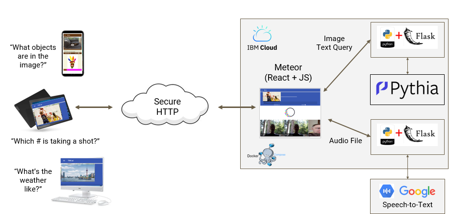
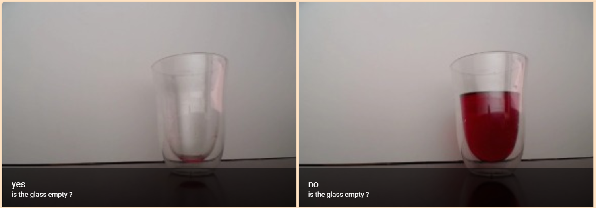
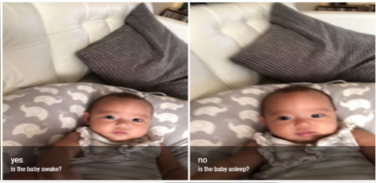

# TikiAI

Tiki was developed for MIDS W251 Final Project by Brent Biseda, Vincio De Sola, Pri Nonis, and Kevin Stone.  Tiki makes any video stream queryable via text or voice.  Users can use natural language to query the image:

 - “What objects are in the image?”  
 - “Which # is taking a shot?”  
 - “What is the weather outside?”  

Tiki works with any browser and requires no installation of software.  


## Architecture

A conceptual architecture of the webapp is shown below.  




## Examples

Is Tiki an optimist or pessimist?  



Do I need to get my baby from crib?  



## Pythia

Tiki is principally based on a Flask server running the [Pythia](https://github.com/facebookresearch/pythia) model, made by Facebook AI Research, which, achieved state of the art results on VQA.  

 - ‘Pythia’ is an homage to the Oracle of Apollo at Delphi  
 - Designed for answering questions related to visual data and automatically generating image captions  
 - Modules for question encoding, image feature extraction, fusion of the two (typically with attention), and classification over the space of answers.  
 - Support for various datasets built-in including VQA, VizWiz, TextVQA, VisualDialog and COCO Captioning.  
 - Built on open-source PyTorch framework  
 
### Pythia Technical Details

 - Used object detector to extract image features with bottom-up attention.
 - ResNet-101 for backbone network.
 - Uses Visual Genome, knowledge base to connect structured image concept to language.
 - The question text is then used to compute the top-down attention
 - Uses GloVe (Global Vectors) word embeddings -> GRU network and a question attention module to extract text features
 - Reached 70.34% on VQA 2.0 with an ensemble of 30 models.
 
 ### Flask Implementation Performance
 
 Initialization of the model takes 16 seconds on a V100, with inference taking 1.5 seconds.
 
 ```
 Initialization: 16.125 Seconds
Tiki : Initializing : Device Type is cuda
Tiki : Initializing : Building - Text Processors
Tiki : Initializing : Building - ResNet152
Tiki : Initializing : Building - Detectron
Tiki : Initializing : Building - PythiaVQA

Inference: 1.5 seconds
```

### Google Cloud Speech to Text Overview

We also run a flask server that accepts wave files that are then sent to the Google Cloud for interpretation.

 - Processes real-time streaming or prerecorded audio
 - Can return recognized text from audio stored in a file
 - Capable of analyzing short-form and long-form audio
 - Can stream text results, immediately returning text as it’s recognized from streaming audio or as the user is speaking
 - API recognizes 120 languages and variants
 - Automatically identifies spoken language

## Conclusion

Visual question answering ([VQA](https://visualqa.org/)) is a new field that combines both computer vision and NLP to provide answers to simple questions using common human syntax.  This project is an implementation of a state-of-the-art VQA model (Pythia) in a web app.  Over time, this type of service will become more common throughout all smart devices such as Alexa, Siri, and others.  Tiki demonstrates the potential for this rollout to be imminent. Here we demonstrate the capacity to use a voice query to provide answers for any iamge on a remote camera.

## Pythia Service in Action


## Quick Start Guide

Setup on localhost with docker-compose.yml.backup.  To utilize this from a mobile device requires an https certificate.

The HTTPS certificate uses NGINX and Lets Encrypt.

```
cd w251-final/containers
docker-compose up -d
docker ps -a
```

### Test Containers Individual Services  

#### Interpreter  
```
cd w251-final/containers/interpreter/app
curl -X POST -F "audio=@sample_audio.wav" localhost:5001/api/interpret
```

#### PythiaVQA  
```
cd w251-final/containers/pythia/app
curl -X POST -F "image=@africa.jpg" localhost:5000/api/getAnswers?question='where%20is%20this%20place%20%3F'
```

#### Meteor
```
127.0.0.1:3000
```

##### NGINX Proxy

For additional information on the utilization of NGINX for proxy and HTTPS certificates, please see this link:
https://github.com/JrCs/docker-letsencrypt-nginx-proxy-companion

#### References
  - Towards VQA Models That Can Read. Singh, Amanpreet and Natarajan, Vivek and Shah, Meet and Jiang, Yu and Chen, Xinlei and Batra, Dhruv and Parikh, Devi and Rohrbach, Marcus. Proceedings of the IEEE Conference on Computer Vision and Pattern Recognition. 2019. [https://github.com/facebookresearch/pythia]

